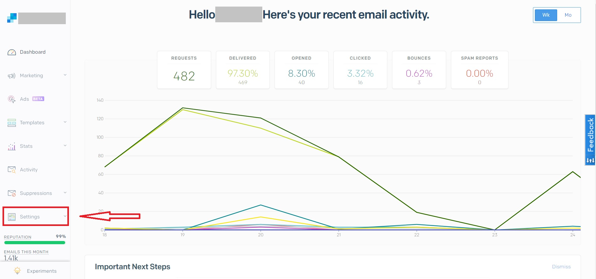
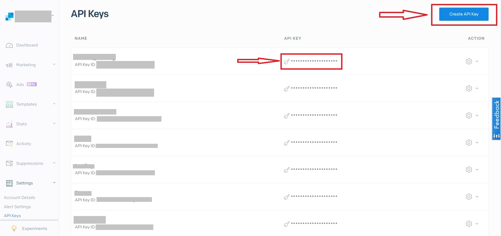
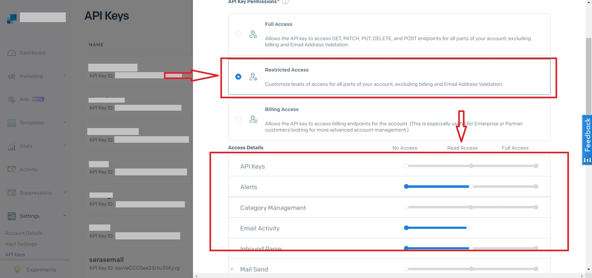

##Snapshot
Features | Details
--- | ---
Release Status | Released
Source API Version | v3
Table Selection | Yes
Column Selection | Yes
Edit Integration | Yes
Replication Type Selection | No
Authentication Parameters | SendGrid API Key SendGrid Email Address
Replication Type | Key Based Replication Full Replication
Replication Key | Date
Suggested Replication Frequency | 24 hrs

Tables/APIs Supported |
--- | ---
Bounce | GlobalSuppression
Campaign | Blocks
Contacts | Groups
Invalid	| ListAll
Segments | SpamReports
Templates |		

##Pre-requisites
1. Generate API Key for Daton
Sign-in to your sendgrid account and click on API Keys under Settings menu

Click on Create API Key

2. Provide restricted access with Read access to the following details -
Alerts, Email Activity, Inbound Parse, Stats, Suppressions, Template Engine, Tracking, User Account

3. Store the API Key securely. It is used for authentication while creating the Sendgrid integration 

##Integrate SendGrid with Daton
1. Signin to Daton 
2. Select SendGrid from Integrations page
3. Provide Integration Name, Replication Frequency, and History. Integration name would be used in creating tables for the integration and cannot be changed later 
4. Provide SendGrid API Key and Email Address to authorize Daton to periodically extract data from SendGrid
5. Post successful authentication, you will be prompted to choose from the list of available tables
6. Then select all required fields for each table
7. Submit the integration
		
##Workflow
1. Integrations would be in Pending state initially and will be moved to Active state as soon as the first job loads data successfully on to the configured warehouse
2. Users would be able to edit/pause/re-activate/delete integration anytime
3. Users can view job status and process logs from the integration details page by clicking on the integration name from the active list
		
##SendGrid Data
####Bounce
Purpose: This endpoint allows you to retrieve all of your bounces.

Source API Documentation <Link> https://sendgrid.com/docs/api-reference/

Replication: Key-Based Replication

Replication Key: created

#####Fields
Name | Target Datatype
--- | ---
email | STRING
created | INTEGER
reason | STRING
status | NUMERIC

####GlobalSuppression
Purpose: This endpoint allows you to retrieve a list of all email address that are globally suppressed.

Source API Documentation <Link> https://sendgrid.com/docs/api-reference/

Replication: Key-Based Replication

Replication Key: created

#####Fields
Name | Target Datatype
--- | ---
email | STRING
created | INTEGER

####Campaign
Purpose: This endpoint allows you to retrieve a list of all of your campaigns.

Source API Documentation <Link> https://sendgrid.com/docs/api-reference/

Replication: Full Replication

Replication Key: NA

#####Fields
Name | Target Datatype
--- | ---
id | INTEGER
title | STRING
subject | STRING
sender_id | INTEGER
list_ids | RECORD
segment_ids | RECORD
categories | RECORD
suppression_group_id | INTEGER
custom_unsubscribe_url | STRING
ip_pool | STRING
html_content | STRING
plain_content | STRING
status | STRING

####Blocks
Purpose: This endpoint allows you to retrieve a list of all email addresses that are currently on your blocks list.

Source API Documentation <Link> https://sendgrid.com/docs/api-reference/

Replication: Key-Based Replication

Replication Key: created

#####Fields
Name | Target Datatype
--- | ---
email | STRING
created | INTEGER
status | STRING

####Contacts
Purpose: This endpoint allows you to add a Marketing Campaigns recipient.

Source API Documentation <Link> https://sendgrid.com/docs/api-reference/

Replication: Full Replication	

Replication Key: NA

#####Fields
Name | Target Datatype
--- | ---
created_at | INTEGER
email | STRING
first_name | STRING
id | STRING
last_clicked | STRING
last_emailed | STRING
last_name | STRING
last_opened | STRING
updated_at | STRING
custom_fields | RECORD

####Groups
Purpose: This endpoint allows you to retrieve a list of all suppression groups created by this user.

Source API Documentation <Link> https://sendgrid.com/docs/api-reference/

Replication: Full Replication

Replication Key: NA

#####Fields
Name | Target Datatype
--- | ---
id | INTEGER
name | STRING
description | STRING
last_email_sent_at | STRING
is_default | BOOLEAN
unsubscribes | INTEGER

####Invalid
Purpose: This endpoint allows you to retrieve a list of all invalid email addresses.

Source API Documentation <Link> https://sendgrid.com/docs/api-reference/

Replication: Key-Based Replication

Replication Key: created

#####Fields
Name | Target Datatype
--- | ---
created | INTEGER
email | STRING
reason | STRING

####ListAll
Purpose: This endpoint allows you to retrieve all of your recipient lists. If you don't have any lists, an empty array will be returned.

Source API Documentation <Link> https://sendgrid.com/docs/api-reference/

Replication: Key-Based Replication

Replication Key: created

#####Fields
Name | Target Datatype
--- | ---
id | INTEGER
name | STRING
recipient_count | INTEGER

####Segments
Purpose: This endpoint allows you to retrieve all of your segments.

Source API Documentation <Link> https://sendgrid.com/docs/api-reference/

Replication: Key-Based Replication

Replication Key: created_at

#####Fields
Name | Target Datatype
--- | ---
id | INTEGER
name | STRING
recipient_count | INTEGER
conditions | RECORD

####SpamReports
Purpose: This endpoint allows you to retrieve all spam reports.

Source API Documentation <Link> https://sendgrid.com/docs/api-reference/

Replication: Key-Based Replication	

Replication Key: created

#####Fields
Name | Target Datatype
--- | ---
email | STRING
created | INTEGER
status | STRING

####Templates
Purpose: This endpoint allows you to retrieve all transactional templates.

Source API Documentation <Link> https://sendgrid.com/docs/api-reference/

Replication: Full Replication	

Replication Key: NA

#####Fields
Name | Target Datatype
--- | ---
id | INTEGER
name | STRING
versions | RECORD
generation | STRING
